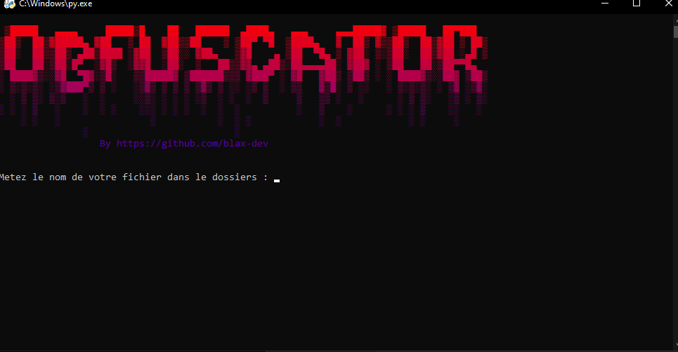

# 🔒 **Obfuscator Tool** 🛠️

 

**Obfuscator Tool** est un outil conçu pour rendre un code source moins lisible et moins compréhensible. L'outil permet d'obfusquer un script Python `.py`, rendant ainsi son contenu difficile à comprendre et donc difficile à exploiter. Cela permet de protéger votre code contre l'accès non autorisé et d'éviter que votre projet soit vu comme un "open source".

🦠 **Protection contre les détections de virus**  
Si votre fichier `.py` est détecté comme un virus, l'Obfuscator Tool permet de le transformer pour qu'il ne soit plus détecté comme tel, tout en préservant son fonctionnement.

---

## 🚀 **Fonctionnalités principales** :

- **Obfuscation** de code source Python.
- **Masquage** du contenu du fichier `.py` pour empêcher l'accès facile au code.
- **Éviter** la détection des fichiers Python comme des virus.

---

## 📊 **Utilisation** :

1. Lancez l'outil.
2. Choisissez le fichier Python `.py` à obfusquer.
3. L'outil va obfusquer le fichier pour le rendre difficilement lisible et moins susceptible d'être détecté comme un virus.
4. Vous pouvez utiliser le fichier obfusqué comme d'habitude, mais avec une sécurité renforcée.

---

## 💬 **Informations de développement** :

- **Développeur** : blax_dev
- **Version** : 1.0
- **Discord** : [Rejoindre le serveur Discord](https://discord.gg/backgen)
